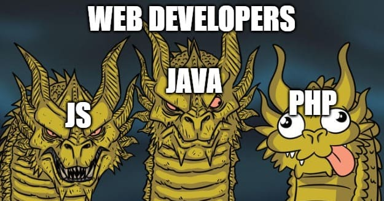

## _🎨 핍박받는 PHP 밈_

개발 도중 필요한 정보를 위해서 레딧과 같은 개발 커뮤니티를 돌아다니다 보면 종종 개발자들이 만든 여러 밈(meme)들을 마주치게 됩니다.
특히 _"HTML은 프로그래밍 언어입니다", "버그 하나 고치기 == 많은 버그 만들기"_ 등등 이런 밈들은 개발에 손 좀 대봤다면 공감하며
웃음을 불러오죠.

하지만 수많은 개발 분야가 있다보니 관련 분야의 개발자가 아닌 경우 어떤 조크인지 이해하지 못해 그냥 넘어가는 경우도 많습니다.
그 중 언어에 관련된 밈들은 대부분 '이 문법 안 이상해?' 라는 식으로 언어를 몰라도 이해할 수 있게 만들어져 있지만,
유독 `PHP`를 주제로 한 밈들 중에는 _"PHP 쓰지 마라!", "PHP 개발자를 피해라!"_ 등 언어와 사용자 자체를 그저 비난하는 밈이
많습니다.
이 때문에 PHP에 대해 잘 모르지만, 그저 남들따라 PHP를 욕하고 피하는 사람들까지 있을 정도입니다.

이 포스트는 이렇게 PHP에 대해 알지 못해 관련 밈을 즐기지 못하던 개발자 분들이 PHP가 욕먹는 이유를 더 자세히 알고,
후에 PHP 밈을 만난다면 *"아 이거 그거지ㅋㅋ"*하고 아는 자만의 웃음을 지으시길 바라며 작성했습니다.

```php
$postPurpose = [
    "PHP에 대해 잘 모르고 욕하는 사람" => "제대로 알고나서 문제점을 콕 집어가며 잘 즐겨주세요",
    "PHP 밈에 공감 없이 지나가던 사람" => "어떤 부분을 비판하는 밈인지 알고나면 더 재미있어요",
    "PHP에 대해 잘 알고 사용하는 사람" => "생각보다 잘 모르던 문제점도 많을거에요 (그러길 바래요)"
]
```

---

:::danger 포스트를 읽기 전 주의사항
먼저, 이 포스트는 PHP 언어에 대한 비판(비난?)이라는 굉장히 민감한 주제를 다루고 있습니다.
작성된 내용에 반대되는 의견을 가지는 독자분들을 충분히 존중하고 있습니다.
대신 아래 사항을 먼저 읽고 난 후 포스트를 즐겨주세요. 언제나 지적과 의견이 담긴 댓글은 환영입니다!

- ❌ _"안써보고 그냥 무작정 욕하는거 아니냐?"_ , _"수많은 사이트가 아직도 PHP를 사용하는데...?"_
  > 저도 2014년에 PHP로 프로그래밍을 시작하고 지금까지도 꾸준히 사용중인 PHP 개발자입니다.
  > 이 포스트는 제 기준에서 신기하고 재미있던 문제점들을 정리해보고 싶은 마음에 시작되었습니다.
- ❌ _"이건 단점이라기보단 이런 이런 목적을 가지고 있는건데?"_
  > 일단 글을 작성할 때 최대한 이유나 예시를 함께 작성해 이해를 도우려고 하고 있습니다.
  > 긍정적인 역할이나 기능이 있더라도 발생되거나 가능성 있는 문제점을 중점적으로 다루는 중이기 때문에,
  > 만약 설명이 부족하거나 잘못된 부분이 있다면 댓글을 통해 말씀해주시면 수정하겠습니다.
- ❌ _"그런 이상한 코드를 작성한 사람 잘못 아니야?"_
  > 사실 제 생각에는 PHP가 욕먹는 이유의 반 이상이 그 "이상한 사용자"들입니다.
  > 그런 사용자들이 저지른 실수와 문제가 꽤 재미있게 다가왔기 때문에 이 포스트에 담아두었습니다.

:::

---

## ❓ PHP가 욕을 먹는 이유

****

이제 본격적으로 PHP가 욕을 먹는 이유에 대해 알아봅시다.
PHP는 많은 개발자들, 심지어는 PHP를 주로 사용하는 개발자들에게까지도 비난 받는 언어입니다.
자세하게 들어가면 정말 재미있는(?) 문제점들이 많지만, 원인을 기준으로 크게 3가지로 나눠서 작성해보겠습니다.

1. PHP는 **계획없이** 여러 개발자의 기여로 만들어졌다.  
   ➡️ 분야를 가리기 않고 언어 전반적으로 비일관적인 상태가 됨
2. PHP는 **누구나** 쉽게 사용할 수 있도록 만들어졌다.  
   ➡️ 과도하게 유연한 언어 스펙을 가짐
3. PHP는 **동적인 웹페이지**만을 위해 단순하게 만들어졌다.  
   ➡️ 웹에 관한 기능만 중구난방으로 추가됨

위 원인과 그로 인해 발생된 문제점을 한번 알아봅시다.

---

### 🤷‍♂️ 1. PHP는 **계획없이** 여러 개발자의 기여로 만들어졌다. (함수와 상수등의 비일관성)

먼저 PHP가 받는 비판의 첫번째는 언어 자체가 일관성이 부족하다는 것입니다.
프로그래밍 언어는 컴퓨터가 이해할 수 있게 만드는 것 이상으로 사람이 이해할 수 있게 만드는 것이 중요합니다.
이를 위해서 이름이나 규칙 등을 충분히 예측 가능하고 일관적이게 만드는게 중요하죠.

하지만 [🐘 PHP : 간단하게 알아보는 PHP의 역사](/posts/php/php-history) 포스트에서도 언급했듯
PHP는 애초에 프로그래밍을 위해 계획적으로 설계된 언어가 아니었습니다.
여러 개발자들이 본인에게 필요한 기능을 하나하나 추가하며 커졌기 때문에,
해당 기능을 추가한 개발자가 선호하는 코드 스타일을 따르게 되었습니다.
결국 언어 전반적으로 여러 이름이나 매개변수의 순서 등의 일관성을 지키지 못한 언어가 되었습니다.

1. 이름을 보고 정체를 알기가 어려운 경우
    - `gzgetss` (gz 파일 포인터에서 한 줄을 읽어서 HTML 태그를 벗겨낸 결과를 반환하는 함수)

2. 비슷한 목적을 가졌으나 네이밍 방식이 다른 경우

    - 슈퍼글로벌 변수: `$GLOBALS`, `$_FILES`
    - 문자열관련 함수: `strpos`, `str_rot13`
    - ...(이런 경우는 너무 많습니다)

3. 함수로도, 변수로도 존재하는 경우

    - 파이값: `M_PI`, `pi()`

4. 비슷한 기능의 인자 순서가 다른 경우

    - `array_map(callable,array)`, `array_filter(array,callable)`

5. 매개변수를 아무렇게나 지원하는 경우

    - `join(array)`, `join(array,string)`, `join(string,array)`

---

### 🥴 너무 유하게 허용하는 예외 문법

PHP는 누구나 웹페이지를 쉽게 만들 수 있게 해주겠다는 목표의식이 있었기 때문에,
개발에 대한 경험이 많지 않은 사람들도 쉽게 사용할 수 있도록 여러가지는 고안해냈습니다.
하지만 이것은 결국 문법적으로도 엄청난 문제가 되었습니다.
먼저 인터프리터 언어들이 흔히 갖는 `"0" == 0 === true`와 같은 약타입 검사로 인한 문제는 제외하더라도 엄청난 문제들이 존재했죠.

1. 존재하지 않는 상수는 문자열로 인정
   PHP에는 PHP7 이전까지 "상수나 함수의 이름으로 존재하지않는 문자"을 코드에 작성할 경우 "문자열"로 처리하는 엄청난 호환성(?)이
   있었습니다.
   `define(TEST, 1);`와 같이 define을 사용 할 때 상수명을 *"상수답게" 작성하는 실수*를 용인해줘야한다고 생각한건지
   뭔지 이유가 전 상상이 안갑니다.

어쨋든 이에 의해 `TEST`라는 상수를 정의하지 않은 채로 `print(TEST)`를 입력할 경우, 이 코드는 `print('TEST')`로
처리됩니다.
따라서 위 방식을 이용해 `print(TEST . define(TEST, 1) . TEST);`라고 작성하면 이는 `TEST11`을 출력합니다.

물론 저렇게까지 이상한 짓을 하는 변태는 어쩔 수 없지만, 진짜 문제는 이제 저게 오타로 인해 발생될 때가 있다는 겁니다.
예를 들어 `null`을 입력해야하는데 다른 언어랑 헷갈려서 `nil`이라고 입력하거나 `nulll`이라고 입력했으면 그건 그냥 그 문자열이
되어버리기 때문에
로직이 비정상적으로 작동하는 경우가 발생합니다.

<br/>

2. 오류는 `@`로 무시
   PHP는 무려 오류 처리가 귀찮거나 어려운 경우를 위해서 @라는 문법이 존재합니다.
   모든 오류를 다 막을 수 있는 것은 아니었지만, `file_get_contents(string)`와 같이 파일이 존재하지 않을 경우 오류가
   나야하는 함수를
   `@file_get_contents(string)`이런 형식으로 사용하면 오류대신 `false`를 반환합니다.
   이 문법이 유용할때도 있었지만 예외를 모두 저렇게 처리하는 습관을 만들어버리는 것도 PHP가 욕먹는 이유중 하나가 되었죠.

<br/>

3. 모든 문자열은 숫자가 될 수 있다
   다른 약타입 언어들은 잘못된 문자열을 숫자로 변환할때 `NaN`이라는 값을 주거나 오류가 발생하는 것과 달리,
   PHP는 친절하게 `0`으로 처리해줍니다. 예를 들어 `(int) "TEST"`는 `0`으로 처리하는 식이었기
   때문에 `0 == "TEST"`라는 조건식의 결과로 `true`가 나오는 엄청난 언어가 되었습니다.
   이는 예상가능하듯 여러 로직에서 치명적인 함정이 되어 작동했기 때문에 이런 상황에 욕이 안나올 수 없겠죠.

이 외에도 `"100 999`라는 문자열이 존재한다면 PHP는 친절하게 앞 숫자만 잘라서 `100`으로 처리해줍니다.
아 물론 `"100_999"` 나 `"100-99"`는 물론 `"100가999"`와 같은 모든 문자열은 `100`으로 처리됩니다.
이 규칙은 전화번호 문자열을 처리할 때 실수 한번으로 모든 사람의 전화번호가 앞자리인 `10`로 변환되는 상황을 발생시키죠.

<br/>

4.

---

## :pushpin: 참고 문헌

- [https://en.wikipedia.org/wiki/PHP](https://en.wikipedia.org/wiki/PHP)
- [https://ko.wikipedia.org/wiki/PHP](https://ko.wikipedia.org/wiki/PHP)
- [https://www.php.net/manual/en/history.php.php](https://www.php.net/manual/en/history.php.php)
- [https://www.php.net/manual/phpfi2.php](https://www.php.net/manual/phpfi2.php)
- [https://www.php.net/manual/php3.php](https://www.php.net/manual/php3.php)
