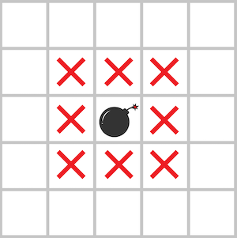

## 문제 설명

- 출처: [프로그래머스 120866 : 안전지대](https://school.programmers.co.kr/learn/courses/30/lessons/120866)

다음 그림과 같이 지뢰가 있는 지역과 지뢰에 인접한 위, 아래, 좌, 우 대각선 칸을 모두 위험지역으로 분류합니다.

****

지뢰는 2차원 배열 board에 1로 표시되어 있고 board에는 지뢰가 매설 된 지역 1과, 지뢰가 없는 지역 0만 존재합니다.

지뢰가 매설된 지역의 지도 board가 매개변수로 주어질 때, 안전한 지역의 칸 수를 return하도록 solution 함수를 완성해주세요.

---

## 제한사항

- board는 $n * n$ 배열입니다.
- 1 ≤ n ≤ 100
- 지뢰는 1로 표시되어 있습니다.
- board에는 지뢰가 있는 지역 1과 지뢰가 없는 지역 0만 존재합니다.

---

## 입출력 예

| board                                                                                                                    | result |
| :----------------------------------------------------------------------------------------------------------------------- | :----- |
| [[0, 0, 0, 0, 0], [0, 0, 0, 0, 0], [0, 0, 0, 0, 0], [0, 0, 1, 0, 0], [0, 0, 0, 0, 0]]                                    | 16     |
| [[0, 0, 0, 0, 0], [0, 0, 0, 0, 0], [0, 0, 0, 0, 0], [0, 0, 1, 1, 0], [0, 0, 0, 0, 0]]                                    | 13     |
| [[1, 1, 1, 1, 1, 1], [1, 1, 1, 1, 1, 1], [1, 1, 1, 1, 1, 1], [1, 1, 1, 1, 1, 1], [1, 1, 1, 1, 1, 1], [1, 1, 1, 1, 1, 1]] | 0      |

- 예제 #1  
  (3, 2)에 지뢰가 있으므로 지뢰가 있는 지역과 지뢰와 인접한 위, 아래, 좌, 우, 대각선 총 8칸은 위험지역입니다. 따라서 16을 return합니다.

- 예제 #2  
  (3, 2), (3, 3)에 지뢰가 있으므로 지뢰가 있는 지역과 지뢰와 인접한 위, 아래, 좌, 우, 대각선은 위험지역입니다. 따라서 위험지역을 제외한 칸 수 13을 return합니다.

- 예제 #2  
  모든 지역에 지뢰가 있으므로 안전지역은 없습니다. 따라서 0을 return합니다.

---

## 풀이 과정

먼저 주어진 2차원 배열에서 지뢰가 매설 된 지역 주변을 안전한 지역을 위험지역으로 바꿉니다.

- 안전한 지역은 0, 지뢰가 매설 된 지역은 1로 표현되기 때문에 위험지역을 2로 표현했습니다.

그 후 남은 안전지역의 수를 반환합니다.

```javascript
const SAFE = 0; //안전한 지역
const BOOM = 1; //지뢰가 매설 된 지역
const WARN = 2; //위험지역

function solution(board) {
  //board는 n*n의 배열이기 때문에 n을 구함
  const n = board.length;

  //주어진 지역과 인접한 안전한 지역을 위험지역으로 변경하는 함수
  const markWarn = (x, y) => {
    //board를 벗어나지 않는 탐색 범위를 반환하는 함수
    const range = (k) => [Math.max(0, k - 1), k, Math.min(n - 1, k + 1)];

    //주어진 x, y로 구한 범위 내의 안전한 지역을 위험 지역으로 변경
    for (const ry of range(y)) {
      for (const rx of range(x)) {
        if (board[ry][rx] === SAFE) {
          board[ry][rx] = WARN;
        }
      }
    }
  };

  //모든 요소를 순회하여 위험지역을 표시
  for (let y = 0; y < n; ++y) {
    for (let x = 0; x < n; ++x) {
      if (board[y][x] === BOOM) {
        markWarn(x, y);
      }
    }
  }

  //보드를 1차원 배열로 바꾸고, 안전한 지역의 수를 구해 반환
  return board.flat().filter((el) => el === SAFE).length;
}
```

---

### 개선

기존 방식과 정반대로, 확인할 지역과 인접 지역에 지뢰가 매설된 지역이 있는지를 확인해 안전한 지역의 수를 구하는 방식으로 변경했습니다.
이를 통해 코드를 더 직관적으로 개선할 수 있었고, 불필요하게 많은 배열 수정 및 접근 횟수를 줄일 수 있었습니다.

```javascript
function solution(board) {
  //board는 n*n의 배열이기 때문에 n을 구함
  const n = board.length;

  //주어진 지역이 안전한 지역인지 확인하는 함수
  const isSafe = (x, y) => {
    const range = (k) => [k - 1, k, k + 1];

    //범위 내에 지뢰가 매설된 지역이 존재하면 false를 반환
    for (const ry of range(y)) {
      for (const rx of range(x)) {
        if (board[ry]?.[rx]) {
          return false;
        }
      }
    }

    //주변 지역이 모두 빈 지역이면 true를 반환
    return true;
  };

  //모든 지역을 순회하여 안전한 지역의 수를 구해 반환
  let answer = 0;
  for (let y = 0; y < n; ++y) {
    for (let x = 0; x < n; ++x) {
      answer += isSafe(x, y);
    }
  }
  return answer;
}
```

문제에서 0은 안전한 지역이 아니라 지뢰가 매설되지 않은 지역을 의미하기 때문에 이 풀이가 더 자연스러운 것 같습니다.
~~처음에 왜 저렇게 풀었지..~~

---

## 숏코딩 (CodeGolf)

조금 더 코드를 간결하게 바꾸어 아래와 같이 정리할 수 있습니다.

```c
solution=_=>_.flatMap((r,y)=>r.map((v,x)=>{for(i=-1;i<2;++i)for(j=-1;j<2;++j)if(_[y+i]?.[x+j])return 0;return 1})).filter(v=>v).length
```
