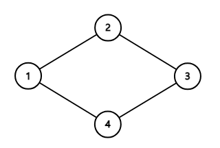
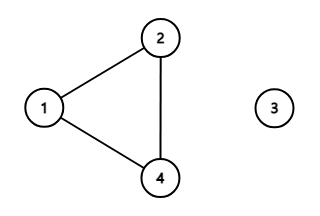

## 문제 설명

- 출처: [프로그래머스 133500 : 등대](https://school.programmers.co.kr/learn/courses/30/lessons/133500)

인천 앞바다에는 1부터 n까지 서로 다른 번호가 매겨진 등대 n개가 존재합니다. 등대와 등대 사이를 오가는 뱃길이 n-1개 존재하여, 어느 등대에서 출발해도 다른 모든 등대까지 이동할 수 있습니다. 등대 관리자 윤성이는 전력을 아끼기 위하여, 이 중 몇 개의 등대만 켜 두려고 합니다. 하지만 등대를 아무렇게나 꺼버리면, 뱃길을 오가는 배들이 위험할 수 있습니다. 한 뱃길의 양쪽 끝 등대 중 적어도 하나는 켜져 있도록 등대를 켜 두어야 합니다.

예를 들어, 아래 그림과 같이 등대 8개와 7개의 뱃길들이 있다고 합시다. 이 경우 1번 등대와 5번 등대 두 개만 켜 두어도 모든 뱃길은 양쪽 끝 등대 중 하나가 켜져 있으므로, 배들은 안전하게 운항할 수 있습니다.


등대의 개수 `n`과 각 뱃길이 연결된 등대의 번호를 담은 이차원 배열 `lighthouse`가 매개변수로 주어집니다. 윤성이가 켜 두어야 하는 등대 개수의 최솟값을 return 하도록 solution 함수를 작성해주세요.

---

## 제한사항

- 2 ≤ `n` ≤ 100,000
- `lighthouse`의 길이 = `n – 1`
  - `lighthouse` 배열의 각 행 `[a, b]`는 `a`번 등대와 `b`번 등대가 뱃길로 연결되어 있다는 의미입니다.
    - 1 ≤ `a` ≠ `b` ≤ `n`
    - 모든 등대는 서로 다른 등대로 이동할 수 있는 뱃길이 존재하도록 입력이 주어집니다.

---

## 입출력 예

| n   | lighthouse                                                                | result |
| :-- | :------------------------------------------------------------------------ | :----- |
| 8   | [[1, 2], [1, 3], [1, 4], [1, 5], [5, 6], [5, 7], [5, 8]]                  | 2      |
| 40  | [[4, 1], [5, 1], [5, 6], [7, 6], [1, 2], [1, 3], [6, 8], [2, 9], [9, 10]] | 3      |

- 예제 #1  
  본문에서 설명한 예시입니다.

- 예제 #2  
  뱃길은 아래 그림과 같이 연결되어 있습니다. 윤성이가 이중 1, 6, 9번 등대 3개만 켜 두어도 모든 뱃길은 양쪽 끝 등대 중 하나가 켜져 있게 되고, 이때의 등대 개수 3개가 최소가 됩니다.
  

---

## 풀이 과정

먼저 주어진 조건을 파악해봅시다.

- 조건 1. _`lighthouse`의 길이 = `n – 1`_  
  `등대 사이의 길의 수가 등대의 수 -1`이라는 이 조건은 등대의 수와 길의 수가 동일한 아래와 같은 형태의 뱃길가 존재하지 않음을 알려줍니다.

  ****

- 조건 2. _모든 등대는 서로 다른 등대로 이동할 수 있는 뱃길이 존재하도록 입력이 주어집니다._  
  `모든 등대는 다른 등대와 길이 연결되어 있다`라는 이 조건은 아래와 같은 형태의 뱃길이 존재하지 않음을 알려줍니다.

  ****

---

위 두가지 조건을 통해 뱃길에는 항상 끝에 위치한 등대가 존재하고, 모든 등대는 1개 이상의 길과 연결되어있음을 파악했습니다.

이제 가장 적은 수의 등대만 켜기 위해 반드시 켜져야하는 등대를 찾아야합니다.

먼저 끝에 위치한 등대, 즉, 길이 1개뿐인 등대는 반드시 자신 혹은 연결된 등대가 켜져야합니다.
이때 자신을 켜는 경우엔 무조건 1개의 길만 밝혀지지만 연결된 등대의 불빛을 켤 경우 여러개의 길이 밝혀질 수 있기 때문에 연결된 등대의 불빛을 켜도록 합니다.

이 후 불빛의 영향을 받아 불빛이 필요 없어진 등대를 목록에서 제거하고 이 과정을 반복해 반드시 불빛이 켜져야하는 최소한의 등대의 수를 구할 수 있습니다.

---

먼저 등대의 연결관계를 관리하기 위해 LightHouse 클래스를 작성했습니다.
등대 번호를 담는 `id`, 연결된 등대 객체를 담는 `connects`를 가진 클래스입니다.
연결과 연결 해제를 처리하는 메소드까지 먼저 작성해두겠습니다.

```javascript
class Lighthouse {
  constructor(id) {
    this.id = id;
    this.connects = new Map();
  }

  //다른 등대와 연결시키는 함수
  //자신과 다른 등대의 연결 목록에 서로를 추가함
  connect(target) {
    this.connects.set(target.id, target);
    target.connects.set(this.id, this);
  }

  //다른 등대와 연결을 해제시키는 함수
  disconnect(target) {
    this.connects.delete(target.id);
    target.connects.delete(this.id);
  }
}
```

그 후 solution 함수에서 모든 등대의 연결 관계를 기록합니다.
저는 등대 객체와의 구분을 위해 solution 함수의 인자를 `lighthouse` 대신 `connects`로 변경했습니다.

```javascript
function solution(n, connects) {
  //n개의 등대 객체가 담긴 2차원 배열 생성
  const lighthouses = new Map(
    [...Array(n).keys()].map((i) => [i + 1, new Lighthouse(i + 1)])
  );

  //모든 등대의 연결 관계를 적용
  connects
    .map(([a, b]) => [lighthouses.get(a), lighthouses.get(b)])
    .forEach(([a, b]) => a.connect(b));

  return 0;
}
```

자신과 연결된 등대의 수가 1개인지 확인 하는 메소드와 제거할 수 있는 등대의 목록을 반환하는 메소드를 작성했습니다.

```javascript
//연결된 등대의 수가 1개인지 확인하는 함수
//연결된 등대의 수가 1개인 경우 반드시 연결된 등대의 불빛이 켜져야함
hasOnlyOneConnect(){
  return this.connects.size === 1;
}

//제거할 수 있는 등대를 반환하는 함수
//연결된 등대가 1개인 경우, 연결된 등대의 모든 연결을 해제시키고 모든 연결이 해제된 등대의 목록를 반환
getRemovalTargets(){
  //모든 연결이 해제되어 제거될 등대를 담는 배열
  //(== 불빛이 켜질 필요가 없는 등대를 담는 배열)
  const removed = [];

  //자신에게 연결된 등대가 1개인 경우
  if(this.hasOnlyOneConnect()){
    //자신과 연결된 등대 (== 불빛이 켜질 등대)
    const connect = this.connects.values().next().value;

    //자신과 연결된 등대의 모든 연결을 해제시키고, 모든 연결이 해제된 등대를 제거 목록에 추가
    //(== 자신과 연결된 등대의 불빛을 켜고, 불빛이 켜질 필요가 없는 등대를 제거 목록에 추가)
    connect.connects.forEach(el => el.disconnect(connect) && removed.push(el));

    //자신과 연결된 등대도 제거 목록에 추가
    //(== 불빛이 켜진 등대도 제거 목록에 추가)
    removed.push(connect);
  }

  //제거할 등대 목록을 제거
  return removed;
}
```

마지막으로 solution 함수에서 모든 길이 밝혀질 때까지 반복하고 답을 반환하는 코드를 작성합니다.

```javascript
let answer = 0;
//모든 등대가 제거될 때 까지 반복
while (lighthouses.size > 0) {
  lighthouses.forEach((lighthouse) => {
    const targets = lighthouse.getRemovalTargets();
    if (targets.length) {
      //제거할 등대가 존재하는 경우 (== 등대의 불빛이 켜진 경우)
      //불빛이 켜진 등대의 수를 증가시키고 제거할 등대를 lighthouse에서 제거
      answer++;
      targets.forEach((el) => lighthouses.delete(el.id));
    }
  });
}

//불빛이 켜진 등대의 수를 반환
return answer;
```

---

## 최종 코드

```javascript
class Lighthouse {
  constructor(id) {
    this.id = id;
    this.connects = new Map();
  }

  //다른 등대와 연결시키는 함수함수
  //본인과 다른 등대의 자식에 서로를 추가함
  connect(target) {
    this.connects.set(target.id, target);
    target.connects.set(this.id, this);
  }

  //다른 등대와 연결을 해제하고, 모든 연결이 해제되었는 지 여부를 반환
  disconnect(target) {
    this.connects.delete(target.id);

    return this.connects.size === 0;
  }

  //연결된 등대의 수가 1개인지 확인하는 함수
  //연결된 등대의 수가 1개인 경우 반드시 연결된 등대의 불빛이 켜져야함
  hasOnlyOneConnect() {
    return this.connects.size === 1;
  }

  //제거할 수 있는 등대를 반환하는 함수
  //연결된 등대가 1개인 경우, 연결된 등대의 모든 연결을 해제시키고 모든 연결이 해제된 등대의 목록를 반환
  getRemovalTargets() {
    //모든 연결이 해제되어 제거될 등대를 담는 배열
    //(== 불빛이 켜질 필요가 없는 등대를 담는 배열)
    const removed = [];

    //자신에게 연결된 등대가 1개인 경우
    if (this.hasOnlyOneConnect()) {
      //자신과 연결된 등대 (== 불빛이 켜질 등대)
      const connect = this.connects.values().next().value;

      //자신과 연결된 등대의 모든 연결을 해제시키고, 모든 연결이 해제된 등대를 제거 목록에 추가
      //(== 자신과 연결된 등대의 불빛을 켜고, 불빛이 켜질 필요가 없는 등대를 제거 목록에 추가)
      connect.connects.forEach(
        (el) => el.disconnect(connect) && removed.push(el)
      );

      //자신과 연결된 등대도 제거 목록에 추가
      //(== 불빛이 켜진 등대도 제거 목록에 추가)
      removed.push(connect);
    }

    //제거할 등대 목록을 제거
    return removed;
  }
}

function solution(n, connects) {
  //n개의 등대 객체가 담긴 2차원 배열 생성
  const lighthouses = new Map(
    [...Array(n).keys()].map((i) => [i + 1, new Lighthouse(i + 1)])
  );

  //모든 등대의 연결 관계를 적용
  connects
    .map(([a, b]) => [lighthouses.get(a), lighthouses.get(b)])
    .forEach(([a, b]) => a.connect(b));

  let answer = 0;
  //모든 등대가 제거될 때 까지 반복
  while (lighthouses.size > 0) {
    lighthouses.forEach((lighthouse) => {
      const targets = lighthouse.getRemovalTargets();
      if (targets.length) {
        //제거할 등대가 존재하는 경우 (== 등대의 불빛이 켜진 경우)
        //불빛이 켜진 등대의 수를 증가시키고 제거할 등대를 lighthouse에서 제거
        answer++;
        targets.forEach((el) => lighthouses.delete(el.id));
      }
    });
  }

  //불빛이 켜진 등대의 수를 반환
  return answer;
}
```

- [ ] TODO: 추후 코드와 설명을 다시 정리할 예정입니다.
      코드랑 설명이 너무 장황하게 작성된 느낌이 강해서...
