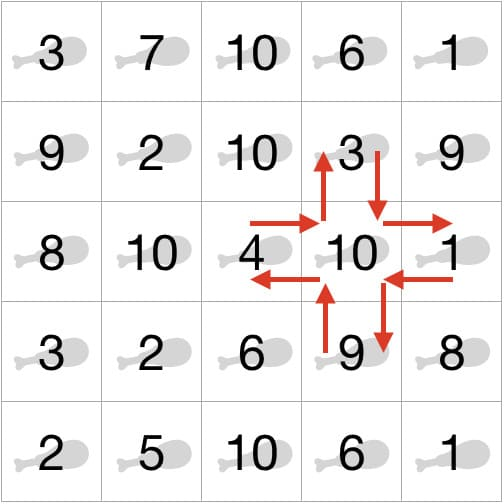
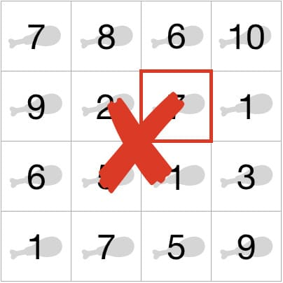
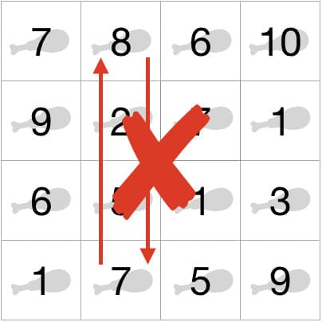
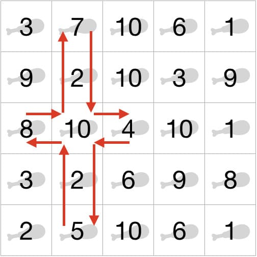
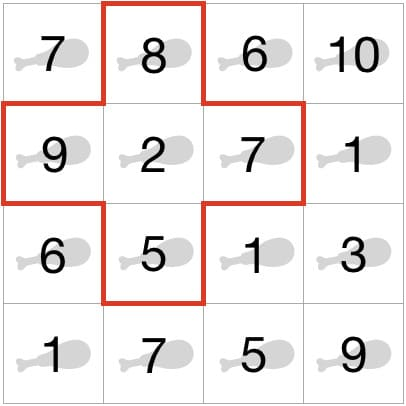
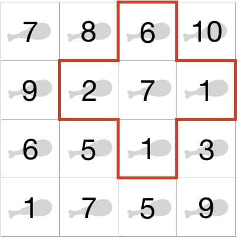
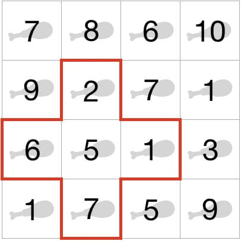
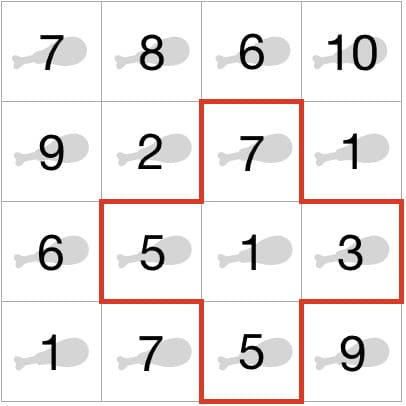
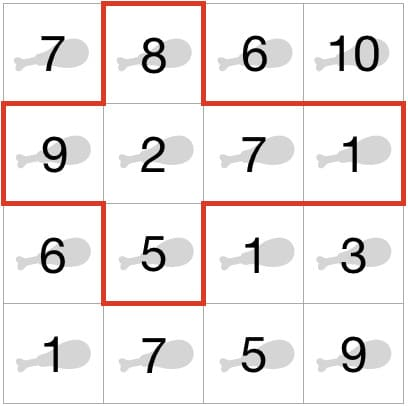
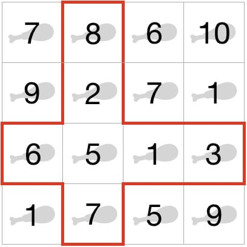

## 문제

자신의 몸이 허약하다고 생각한 정택은 강해지기위해 운동을 하기 시작했다. 알고리즘 피트니스 센터의 센터장인 종민의 조언에 따라 “먹는 것 까지 운동이다.” 라는 철칙을 잘 따르고 있다. 전날 무리하게 운동한 여파로 늦잠을 자게되어, 오늘 먹을 단백질 도시락을 챙길 여유가 없었다. 어제 무리하게 운동한 것이 아까운 정택은 사무실 근처에 있는 편의점을 돌며 얻을 수 있는 최대의 단백질을 확보하려고 한다. 같은 단백질 함양을 가진 제품은 동일한 제품이고, 같은 도시락을 여러 번 먹으면 질리기때문에 서로 다른 제품을 통해 단백질을 섭취하고자 한다. 힘이 상승하고자하는 정택은 편의점을 ‘+’ 모양으로 순회하려고 한다.

  


위와 같이 편의점 정보가 존재한다고 했을 때, 각 칸에 해당하는 숫자는 해당 편의점에서 얻을 수 있는 단백질의 g 수 이다. 첫 번째 그림에서 얻을 수 있는 서로 다른 종류의 단백질 도시락 개수는 4개이며, 얻을 수 있는 단백질 g 수는 7+2+10+9 로 28 이다. 두 번째 그림에서 얻을 수 있는 서로 다른 종류의 단백질 도시락 개수는 5개이며, 얻을 수 있는 단백질 g 수는 1+3+4+9+10 로 27 이다.

순회 경로의 경우 만약 중앙을 기점으로 봤을 때, 상하좌우 경로의 길이를 서로 달리할 수 있다. 이때 경로의 길이 최솟값은 상하좌우 각각 모두 1로 고정한다. 즉, 하나의 편의점만 들를 수 없고, 직선 형태, 'ㄱ', 'ㄴ' 등의 모양으로 순회를 할 수 없다는 것이다. 예를 들면, 다음과 같이 다양하게 존재할 수 있다.

  
  
  
  


시작 지점에서 출발하여 다시 시작 지점으로 돌아온다고 했을 때, N \* N 의 편의점 단백질 도시락 정보에서 가장 많이 얻을 수 있는 단백질 함량의 합을 구해보자.

편의점 정보가 주어졌을 때, 답을 구하는 과정은 다음과 같다. (총 6가지가 존재하는 것은 아니며, 몇 가지 경우는 생략되었다.)

  
  
  
  
  


마지막 그림에서 얻어지는 숫자의 합 1+2+3+5+6+7+8 인 32 가 정답이다.

## 입력

첫 번째 줄에 테스트 케이스의 개수 T(5 ≤ T ≤ 50) 가 주어진다. 각 테스트 케이스의 첫째 줄에 N(3 ≤ N ≤ 20) 이 주어지고, N 개의 줄에 걸쳐 N 개의 숫자가 공백을 통해 구분하여 입력된다.
각각의 입력되는 숫자는 1 부터 100 을 포함한 정수이다.

## 출력

각 테스트 케이스에 해당하는 결과값을 한 줄에 하나씩 “#t result” 포맷으로 출력한다. (t는 1부터 T까지의 정수이다)

```예제_입력
5
4
7 8 6 10
9 2 7 1
6 5 1 3
1 7 5 9
10
7 7 5 8 3 1 5 6 4 4
1 8 4 4 4 6 3 7 9 3
8 8 6 7 3 8 5 4 3 7
3 4 1 6 4 3 5 3 2 7
9 9 1 8 3 9 6 4 2 2
4 5 5 7 4 7 1 8 9 6
1 7 7 8 5 2 6 1 5 2
3 9 6 1 8 2 3 4 5 4
2 1 1 2 9 6 1 4 6 6
9 2 4 6 7 1 4 3 8 6
8
4 7 1 6 8 5 8 7
4 5 6 1 9 1 1 8
7 2 1 4 1 7 1 1
3 8 6 2 5 2 5 1
9 8 8 4 8 7 8 9
1 2 2 4 3 3 9 4
3 9 3 2 2 8 5 9
4 3 4 2 3 4 6 6
6
5 3 9 3 7 5
9 4 9 1 5 4
3 3 7 8 1 6
6 8 7 3 3 3
1 3 9 8 5 6
1 1 3 7 6 3
4
7 7 3 6
1 3 2 1
9 6 1 8
2 2 2 2
```

```예제_출력
#1 32
#2 45
#3 45
#4 39
#5 36
```

## 제한 사항

- 제한시간 : 3초

---

## 풀이

문제에서 제시된 조건을 정리해보면 아래와 같다.

1. `같은 단백질 함양을 가진 제품은 동일한 제품이고, 같은 도시락을 여러 번 먹으면 질리기때문에 서로 다른 제품을 통해 단백질을 섭취하고자 한다.`

   - 선택된 편의점(칸)의 단백질 함양(값) 중 같은 것은 제외하고 합산해야 한다.

2. `정택은 편의점을 ‘+’ 모양으로 순회하려고 한다.`

   - 따라서 첫 줄과 마지막 줄은 제외한 후 순회해야 한다.
     제한시간이 3초로 여유로운 편이기 때문에 전체 순회를 시도해도 될 것 같다.  
     가능한 모든 경우의 수를 순회해 가장 큰 값을 찾아 해결했다.

3. `정택은 사무실 근처에 있는 편의점을 돌며 얻을 수 있는 최대의 단백질을 확보하려고 한다.`
   - 최대의 단백질을 확보해야 하므로 가장 큰 값을 찾아야 한다.

```cpp
#include <iostream>
using namespace std;

//중복을 제외한 모든 값의 합을 구하는 함수
int uniqueSum(int arr[], int length){
  int temp[length]; //중복을 제외한 값들을 저장할 배열
  int count = 0; //중복을 제외한 값의 개수(인덱스용)
  int sum = 0; //중복을 제외한 값들의 합

  bool isNew; //중복 여부를 판단하는 변수
  for(int i = 0; i < length; ++i){ //배열의 모든 값을 순회
    isNew = true;
    //중복을 제외한 값들의 배열을 순회하며 중복 여부를 판단
    for(int j = 0; j < count; ++j){
      if(temp[j] == arr[i]){
        isNew = false;
        break;
      }
    }
    if(isNew){ //중복이 아니라면
      temp[count++] = arr[i]; //중복을 제외한 값들의 배열에 추가
      sum += arr[i]; //중복을 제외한 값들의 합에 추가
    }
  }
  return sum;
}

int test(){
  //테스트 케이스의 가로 세로 길이(N) 입력 받기
  int n;
  cin >> n;

  //테스트 케이스의 편의점 정보 입력 받기
  int arr[n][n];
  for(int i = 0; i < n; ++i){
    for(int j = 0; j < n; ++j){
      cin >> arr[j][i];
    }
  }

  //테스트 케이스의 편의점 정보를 순회하며 최대의 단백질 함양을 구하기
  int temp[n + n], current, max = -1;
  for(int i = 1; i < n - 1; ++i){ //첫 줄과 마지막 줄은 제외
    for(int j = 1; j < n - 1; ++j){ //첫 줄과 마지막 줄은 제외
      for(int k = 0; k < n; ++k){ //가로 세로 방향 순회를 한번에 진행하고 temp 변수에 입력
        temp[k] = arr[i][k];
        temp[k + n] = arr[k][j];
      }
      current = uniqueSum(temp, n + n); //중복을 제외한 모든 값의 합을 구함
      if(max < current){
        max = current; //최대값을 갱신
      }
    }
  }

  return max;
}

int main() {
  //테스트 케이스의 수(T) 입력 받기
  int t;
  cin >> t;

  //테스트 케이스의 수만큼 테스트를 반복
  for(int i = 0; i < t; ++i){
    cout << "#" << (i + 1) << " " << test() << endl;
  }

  return 0;
}
```
